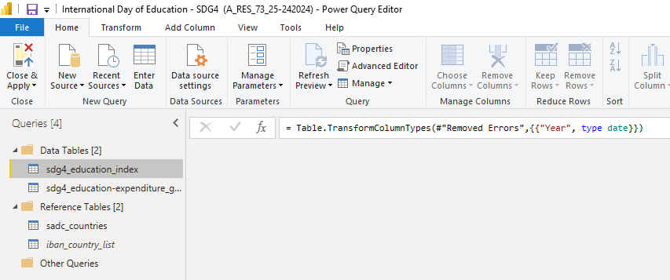

<h1 align="center">United Nations International Day of Education, 24 January 2022</a></h1>

## Architecture (ETL)

The image below depicts the query management structure in the Power Query Editor and the corresponding tables used to build out the model:

**Analytics Tool**: Microsoft PowerBI (https://powerbi.microsoft.com)

UNDP Human Development Data Center: The human development data are sourced from international data agencies with the mandate, resources, and expertise to collect national data on specific indicators unless otherwise noted.

### **Human Development Report Office Statistical Data API**

The Human Development Report Office (HDRO) offers this REST API for the developers to query human development related data in JSON format. The data can be queried by indicator id(s), year(s) and country code(s) and group by any order. 

**API Home**: http://ec2-54-174-131-205.compute-1.amazonaws.com/API/Information.php

### **Using the API**

Users should query the API using the GET method. The resource selection can be done using single or multiple strings, as follows: country_code = 'AFG' indicator_id = '72206' year = '1980, 1990, 2019'

The options selection is by default set to: Data Structure: structure = ciy [ciy, yic, yci, iyc, icy]

[http://ec2-54-174-131-205.compute-1.amazonaws.com/API/HDRO_API.php/country_code=AFG,ZWE/indicator_id=103206,103606,103706/year=1990,2013,2019/structure=ciy](http://ec2-54-174-131-205.compute-1.amazonaws.com/API/HDRO_API.php/country_code=AFG,ZWE/indicator_id=103206,103606,103706/year=1990,2000,2019/structure=ciy)

## Extraction

Data is loaded using the REST API calls to the UNDP API platform indicated in the section above, the following are the indicators in focus and the accompanying API call structures:

### **Education Index (Indicator ID - 103706)**

**API Call:**  http://ec2-54-174-131-205.compute-1.amazonaws.com/API/HDRO_API.php/indicator_id=103706

> curl --location --request GET 'http://ec2-54-174-131-205.compute-1.amazonaws.com/API/HDRO_API.php/indicator_id=103706'

Education index is an average of mean years of schooling (of adults) and expected years of schooling (of children), both expressed as an index obtained by scaling with the corresponding maxima.

**Data Source:** HDRO calculations based on expected years of schooling and mean years of schooling from UNESCO Institute for Statistics (2020) and other sources. Accessed on 21 July 2020.

**URL**: http://hdr.undp.org/en/indicators/103706

### **Government Expenditure on Education (Indicator ID - 149206)**

**API Call**: http://ec2-54-174-131-205.compute-1.amazonaws.com/API/HDRO_API.php/indicator_id=149206

> curl --location --request GET 'http://ec2-54-174-131-205.compute-1.amazonaws.com/API/HDRO_API.php/indicator_id=149206'

SDG 1.a Ensure significant mobilization of resources from a variety of sources, including through enhanced development cooperation, in order to provide adequate and predictable means for developing countries, in particular least developed countries, to implement programmes and policies to end poverty in all its dimensions. 

**Data Source:** World Bank (2020a). World Development Indicators database. Washington, DC. http://data.worldbank.org. Accessed 22 July 2020.

**URL**: http://hdr.undp.org/en/indicators/149206

## Transformation

Key Transformation Steps in PowerQuery - Using the M-Language [^PowerQuery-M]

> 1. **Load the source json formatted data** = Json.Document(Web.Contents("http://ec2-54-174-131-205.compute-1.amazonaws.com/API/HDRO_API.php/indicator_id=103706"))
> 2. **Create a *table from records*, using record field names as column names** = Table.FromRecords({Source})
> 3. **Translate all columns other than a specified set into attribute-value pairs, combined with the rest of the values in each row.** = Table.UnpivotOtherColumns(#"Changed Type", {}, "Attribute", "Value")
> 4. **Splits the specified columns into a set of additional columns using the specified splitter function** = Table.SplitColumn(#"Unpivoted Columns", "Attribute", Splitter.SplitTextByDelimiter(".", QuoteStyle.None), {"Attribute.1", "Attribute.2", "Attribute.3", "Attribute.4"})
> 5. **Returns a table with the rows removed from the input table that contain  an error in at least one of the cells. If a columns list is specified,  then only the cells in the specified columns are inspected for errors.** = Table.RemoveRowsWithErrors(#"Changed Type2", {"Index"})

## Load

Below is the loaded model of the tables created to produce the visuals, it uses the traditional Star Schema approach [^ Star Schema]

## Networking

Connecting and building networks is always part of my priorities, please reach out if you have any ideas on collaborative efforts or any suggestions on ways I could improve my work, hopefully I would be as much usefulness to you in return. 

[][linkedin] [][github] [][facebook]

## License

This license lets others distribute, remix, adapt, and build upon your  work, even commercially, as long as they credit you for the original  creation. This is the most accommodating of licenses offered.  Recommended for maximum dissemination and use of licensed materials. (https://creativecommons.org/licenses/)

<!-- Footnotes, Definitions-->

[^PowerQuery-M]: Microsoft  Power Query provides a powerful data import experience that encompasses  many features. Power Query works with Analysis Services, Excel, and  Power BI workbooks. A core capability of Power Query is to filter and  combine, that is, to mash-up data from one or more of a rich collection  of supported data sources. Any such data mashup is expressed using the  Power Query M Formula Language. It's a functional, case sensitive  language similar to F#.

[^ Star Schema]: **Star schema** is a mature modeling approach widely  adopted by relational data warehouses. It requires modelers to classify  their model tables as either *dimension* or *fact*. (https://docs.microsoft.com/en-us/power-bi/guidance/star-schema)

<!-- Profile Links -->

[linkedin]: https://www.linkedin.com/in/lehlohonolomakoti/
[github]: https://www.github.com/lmakoti/
[facebook]: https://www.facebook.com/lmakoti/

<!-- Shields Profile Links -->

[linkedinbadge]: https://img.shields.io/badge/-uditkumarchatterjee-0e76a8?style=flat&labelColor=0e76a8&logo=linkedin&logoColor=white

