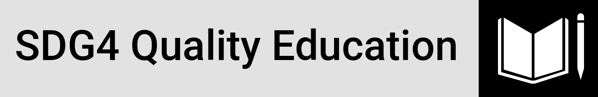

<h1 align="center">United Nations International Day of Education</a></h1>

  <a href="#overview">Overview</a> •
  <a href="#architecture">Architecture</a> •
  <a href="#definitions">Definitions</a> •
  <a href="#dashboard (Report)">Dashboard</a> •
  <a href="#networking">Networking</a> •
  <a href="#license">License</a>

## Overview

Education is a human right, a public good and a public responsibility.

### SDG4 Quality Education

**Ensure inclusive and equitable quality education and promote lifelong learning opportunities for all by 2030**

The United Nations General Assembly proclaimed 24 January as **International Day of Education** in celebration of the role of education for peace and development.

Without inclusive and equitable quality education and lifelong opportunities for all, countries will not succeed in achieving gender equality and breaking the cycle of poverty that is leaving millions of children, youth and adults behind. 

Today, 258 million children and youth still do not attend school; 617 million children and adolescents cannot read and do basic math; less than 40% of girls in sub-Saharan Africa complete lower secondary school and some four million children and youth refugees are out of school. Their right to education is being violated and it is unacceptable.

## Architecture

UNDP Human Development Data Center: The human development data are sourced from international data agencies with the mandate, resources, and expertise to collect national data on specific indicators unless otherwise noted.

**Human Development Report Office Statistical Data API**

The Human Development Report Office (HDRO) offers this REST API for the developers to query human development related data in JSON format. The data can be queried by indicator id(s), year(s) and country code(s) and group by any order. 

**API Home**: http://ec2-54-174-131-205.compute-1.amazonaws.com/API/Information.php

**Using the API**

Users should query the API using the GET method. The resource selection can be done using single or multiple strings, as follows: country_code = 'AFG' indicator_id = '72206' year = '1980, 1990, 2019'

The options selection is by default set to: Data Structure: structure = ciy [ciy, yic, yci, iyc, icy]

[http://ec2-54-174-131-205.compute-1.amazonaws.com/API/HDRO_API.php/country_code=AFG,ZWE/indicator_id=103206,103606,103706/year=1990,2013,2019/structure=ciy](http://ec2-54-174-131-205.compute-1.amazonaws.com/API/HDRO_API.php/country_code=AFG,ZWE/indicator_id=103206,103606,103706/year=1990,2000,2019/structure=ciy)

## Definitions

**Education Index (Indicator ID - 103706)**

Education index is an average of mean years of schooling (of adults) and expected years of schooling (of children), both expressed as an index obtained by scaling with the corresponding maxima.

**Data Source:** HDRO calculations based on expected years of schooling and mean years of schooling from UNESCO Institute for Statistics (2020) and other sources. Accessed on 21 July 2020.

**URL**: http://hdr.undp.org/en/indicators/103706

**Government Expenditure on Education (Indicator ID - 149206)**

SDG 1.a Ensure significant mobilization of resources from a variety of sources, including through enhanced development cooperation, in order to provide adequate and predictable means for developing countries, in particular least developed countries, to implement programmes and policies to end poverty in all its dimensions. 

**Data Source:** World Bank (2020a). World Development Indicators database. Washington, DC. http://data.worldbank.org. Accessed 22 July 2020.

**URL**: http://hdr.undp.org/en/indicators/149206

## Dashboard (Report)

1. Main Report Page/Landing Page

2. Metadata Report Page

## Networking

Connecting and building networks is always part of my priorities, please reach out if you have any ideas on collaborative efforts or any suggestions on ways I could improve my work, hopefully I would be as much usefulness to you in return. 

[][linkedin] [][github] [][facebook]

## License

This license lets others distribute, remix, adapt, and build upon your  work, even commercially, as long as they credit you for the original  creation. This is the most accommodating of licenses offered.  Recommended for maximum dissemination and use of licensed materials. (https://creativecommons.org/licenses/)

<!-- Profile Links -->

[linkedin]: https://www.linkedin.com/in/lehlohonolomakoti/
[github]: https://www.github.com/lmakoti/
[facebook]: https://www.facebook.com/lmakoti/

<!-- Shields Profile Links -->

[linkedinbadge]: https://img.shields.io/badge/-uditkumarchatterjee-0e76a8?style=flat&labelColor=0e76a8&logo=linkedin&logoColor=white

