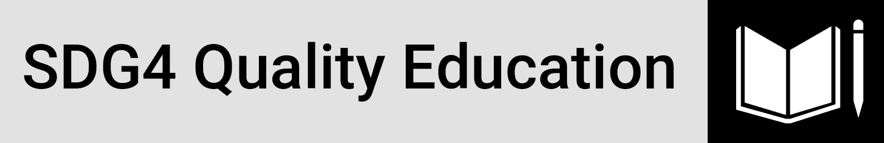
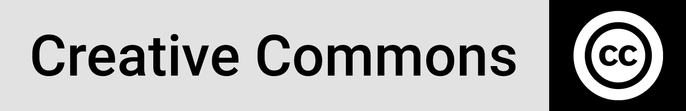

<<<<<<< HEAD
<h1 align="center">An analysis of regional education indicators in relation to the standard of living using <a href="https://powerbi.microsoft.com/en-us/" target="_blank" style="color:#000">Microsoft Power BI</a></h1>
=======
<h4 align="center">An analysis of regional education indicators in relation to the standard of living using <a href="https://powerbi.microsoft.com/en-us/" target="_blank" style="color:#000">Microsoft Power BI</a></h4>
>>>>>>> c70d5a988329f6624f0e04f13b2064b0011085d8

  <a href="#overview">Overview</a> •
  <a href="#definitions">Definitions</a> •
  <a href="#architecture">Architecture</a> •
  <a href="#dashboard">Dashboard</a> •
  <a href="#networking">Networking</a> •
  <a href="#license">License</a>

## Overview

## Architecture

## Definitions

## Dashboard

## Networking

Connecting and building networks is always part of my priorities, please reach out if you have any ideas on collaborative efforts or any suggestions on ways I could improve my work, hopefully I would be as much usefulness to you in return. 

[][linkedin] [][github] [][facebook]

## License

This license lets others distribute, remix, adapt, and build upon your  work, even commercially, as long as they credit you for the original  creation. This is the most accommodating of licenses offered.  Recommended for maximum dissemination and use of licensed materials. (https://creativecommons.org/licenses/)

<!-- Profile Links -->

[linkedin]: https://www.linkedin.com/in/lehlohonolomakoti/
[github]: https://www.github.com/lmakoti/
[facebook]: https://www.facebook.com/lmakoti/

<!-- Shields Profile Links -->

[linkedinbadge]: https://img.shields.io/badge/-uditkumarchatterjee-0e76a8?style=flat&labelColor=0e76a8&logo=linkedin&logoColor=white

